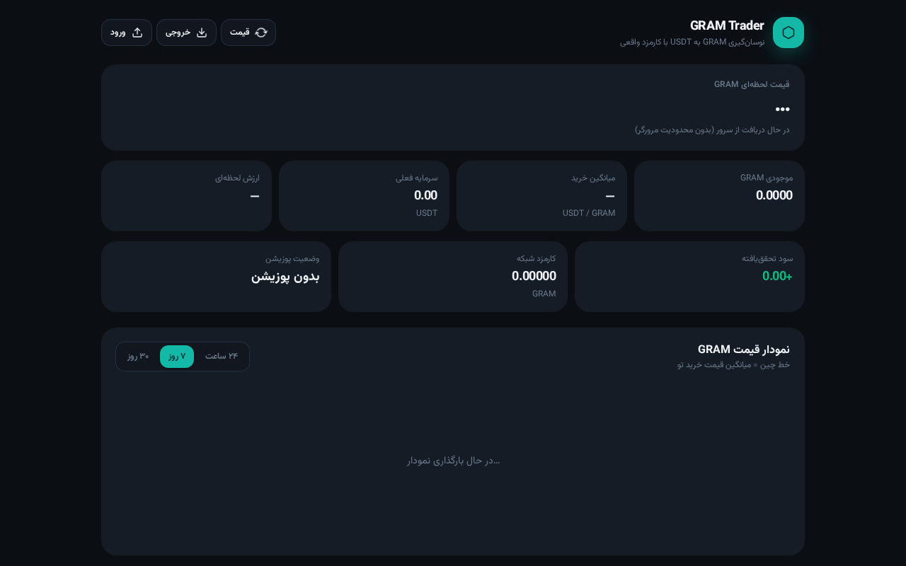
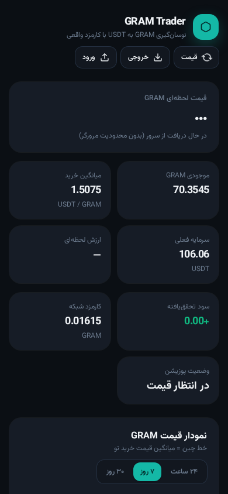

# GRAM Trader

**نوسان‌گیری GRAM به USDT با کارمزد واقعی**

ابزار سبک و دقیق برای ثبت، پیگیری و شبیه‌سازی معاملات GRAM/USDT با احتساب کارمزد شبکه و DEX.

<p align="center">
  
</p>

<p align="center">
  
</p>

---

## ویژگی‌ها

| قابلیت | توضیح |
|--------|--------|
| **قیمت لحظه‌ای** | Binance + CoinGecko با کش ۴۵ ثانیه |
| **ثبت معامله** | خرید / فروش با تاریخ، GRAM، USDT و کارمزدها |
| **کارمزد واقعی** | کارمزد شبکه + کارمزد DEX در محاسبات |
| **میانگین خرید** | میانگین وزنی قیمت خرید (FIFO) |
| **سود/زیان** | تحقق‌یافته و تحقق‌نیافته |
| **شبیه‌ساز فروش** | محاسبه سود خالص در قیمت‌های هدف |
| **نمودار قیمت** | ۲۴ ساعت / ۷ روز / ۳۰ روز + خط میانگین خرید |
| **Export / Import** | ذخیره و بازیابی معاملات به صورت JSON |
| **هشدار تلگرام** | اعلان سقف/کف قیمت و هدف سود (در حالت dev) |

---

## اجرا

```bash
# نصب
npm install

# توسعه
npm run dev

# بیلد برای production
npm run build

# پیش‌نمایش بیلد
npm run preview
```

بعد از `npm run dev` برو به: [http://localhost:5173](http://localhost:5173)

---

## تکنولوژی

- **React 19** + TypeScript
- **Vite 6**
- **TanStack Query** — قیمت و نمودار
- **Recharts** — نمودار قیمت
- **Tailwind CSS 4** — تم تاریک
- **Radix UI** — Dialog و Switch
- **localStorage** — ذخیره معاملات و تنظیمات تلگرام

---

## استقرار (Deploy)

### GitHub Pages

1. در `vite.config.ts` اگر رپو در ساب‌مسیر است `base` را تنظیم کن:
   ```ts
   base: "/gram-trader/",
   ```
2. Actions یا دستی:
   ```bash
   npm run build
   # محتویات dist را به branch gh-pages بفرست
   ```

### Vercel / Netlify / Cloudflare Pages

فقط رپو را وصل کن — دستور بیلد: `npm run build` و خروجی: `dist`.

> **توجه تلگرام:** API تلگرام در مرورگر CORS دارد. در `npm run dev` از پروکسی Vite استفاده می‌شود. برای production روی GitHub Pages هشدار تلگرام کار نمی‌کند مگر یک backend/proxy (مثلاً Cloudflare Worker) اضافه کنی.

---

## ساختار

```
src/
  components/
    dashboard.tsx      # داشبورد اصلی
    price-chart.tsx    # نمودار
    telegram-panel.tsx # تنظیمات هشدار
    alert-watcher.tsx  # منطق هشدار
    ui/                # Button, Card, Dialog, ...
  lib/
    trades.ts          # محاسبه پوزیشن و FIFO
    market.ts          # قیمت و نمودار (Binance / CoinGecko)
    telegram.ts        # ارسال پیام تلگرام
    telegram-settings.ts
    utils.ts
```

---

## لایسنس

MIT
